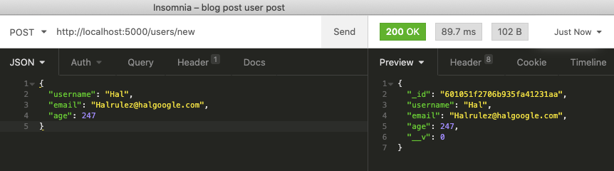

# Creating a Node.js, Express, & MongoDB Backend From Scratch

*The fully complete codebase for this project is public at [THIS](https://github.com/halented/men-backend-codebase) github repo, if you would rather just poke around than reading this whole walkthrough.*

__

I've been a big fan of React for a while, but that part of the MERN stack isn't involved in this post. If anyone does have a specific question about how to hook the backend we are about to build up with a React frontend, please leave a comment and I would be happy to make a new post with that information as well.

Since this is focused on MERN without the R, the acronym we'll use for this post is MEN. Why not. 😄

Here's the overview of the walkthrough: 

1. Initializing a folder with a package manager
2. Adding necessary dependencies (and discussing the purposes of each)
3. Establishing a connection to MongoDB through [Atlas](https://www.mongodb.com/cloud/atlas)
4. Establishing an Express application & selecting the local port on which to run it
5. Creating A Model
6. Creating CRUD routes for that model
7. Testing your code out with an API tester like Postman or Insomnia

It should be a good time. This post will assume that you have a medium level of JavaScript/programming capabilities -- that is, if you are just starting out with learning JS, this post might knock you on your ass, so bookmark it for later and revisit when you're pretty good with the basics. This post also assumes you have NodeJs installed on your computer already. You can check if you do by running the command `node -v` in your terminal. If it does not spit out a version for you, please install Node from [HERE](https://nodejs.org/en/) before beginning this walkthrough. 

Other than that, if you're ready to go then let's go!

## Initializing a folder with a package manager

This part is pretty straightforward. 
- From your terminal, navigate to whatever directory you want this project to live in
- Make a new folder with `mkdir MEN-backend`
- `cd` into that folder
- Enter the command `yarn init` or `npm init`, depending on which package manager you want to use. 

The differences between yarn and npm are negligable for our circumstances, but I use yarn because the word's cute. Once you've done that, your terminal will ask you a series of questions -- you can just slam on the enter key a bunch of times to stick with the defaults, or you can change the versioning/name/licensing info at your discretion. These details will not affect the project.

Once that's complete, you'll notice a package.json file appear inside your MEN-backend directory. This is where your project will keep track of necessary dependencies and libraries that we'll be installing, like Express.

One that note, let's get to installing.

## Adding necessary dependencies 

One important tip for this section: the words *dependency*, *library*, and *package* are going to be used pretty much interchangably. I'm just using these phrases to reference any outside code base that we'll be making use of in our project. 

The first thing add is [Express](http://expressjs.com/), of course. Very necessary for MEN. Adding packages to your established `package.json` file is pretty easy; from inside of our backend directory you can run the command `yarn add express` and watch as your terminal does the work of adding it. Once it's done, you will notice that a new folder, `node_modules` has appeared in our directory, as well as a file called `yarn.lock`. 

These two items help your project keep track of not only the libraries that you want to use in your project, but any libraries that those libraries are using. Do not edit these items directly. If something goes wonky with your yarn lock or node modules, just delete both of them and run `yarn install` to have 'em regenerate. 

Here are the other packages you should install. With each you can just run `yarn add <package name>` to add it to your package.lock file: 

- [cors](https://www.npmjs.com/package/cors)
    - CORS stands for "cross-origin resource sharing" and the package allows you to configure which domains are trusted and which ones are not. We will be making requests to our backend from a separate origin (that's where insomnia or postman will come into play), so we need to install CORS to allow us to do that. 

- [dotenv](https://www.npmjs.com/package/dotenv) 
    - We are going to need a sort of secret key to access our MongoDB database on the Atlas website. If you plan on uploading your project to Github or some other code sharing site, you *shouldn't* upload your secret key as well. Best practices dictate that you should keep that kind of information in a local environment variable. The dotenv package will allow us to add a file called `.env` to our project, put our secret key in there, and load it into other files where necessary. The library will configure environment variables to your [process.env](https://codeburst.io/process-env-what-it-is-and-why-when-how-to-use-it-effectively-505d0b2831e7?gi=ce14aad160a0) object, which makes it global for your project.  We aren't going to go through uploading this project to Github, but if you are doing that, you'll want to add the `.env` file to your `.gitignore` list.

- [mongoose](https://mongoosejs.com/docs/index.html)
    - Mongoose allows us to: map the model attributes and requirements to the database, create new collections and documents in our database, and make queries to retrieve info from the database.

- [nodemon](https://nodemon.io/)
    - We will use nodemon to actually serve the backend routes locally on whatever port we choose. If we were to choose port 5000, say, we can run nodemon to have our app served on http://localhost:5000/

## Establishing a connection to MongoDB / Establishing an Express App

There are different ways to use MongoDB, but using the Atlas website gives you a pretty clear and easy tools for interacting with your data, and you get one free database to fiddle around with so you don't have to pay to use it for our purposes. 

First, set up an account. Head to https://www.mongodb.com/cloud/atlas & fill out the Start Free steps. Pick the free options of course, and select "Shared Clusters" when prompted.

Under provider and region, select Google Cloud, and then pick whichever region is closest to you. This is where the server is located, so the closer you get the less latency between requests. Make sure your Cluster Tier is set to "M0 Sandbox", name it whatever you'd like, and click Create Cluster. 

You can just let that sit while it creates -- don't mess with the webpage or close it until it's done. While you're waiting, maybe listen to a song. Have some water. Stretch your back & unfocus your eyes for a second.

Okay, now it's time to write some code. 

In the topmost directory of your project, create a file called `server.js`. This is will act as the main hub for your app and its connections to the DB. The first thing we need to do is get Express in there. Here's what it looks like to actually establish an Express app:

```javascript
const express = require('express')
const app = express()
```

The invoking parentheses following express call a constructor method from inside the Express library which builds the boilerplate for our app. Reminder! Express is a framework using NodeJs. It's the most important part of allowing us to use JavaScript as a backend server. 

Now that we've actually got an app to fiddle around with, let's tell that app that it should be allowed to accept requests from outside sources by handing it the CORS library. 

```javascript
const cors = require('cors')
app.use(cors())
```

Next we will tell the express app that it should expect to serve and receive data in the JSON format. Our MongoDB backend will take care of that for us, so we don't need to configure it on that end, just this one. 

```javascript
app.use(express.json())
```

Okay, the next thing is to actually connect your DB with your Express app. Here we have a group of libraries coming together to make ends meet. Firstly, we need to get Mongoose in there to usher the data back and forth for us -- we can think of Mongoose as a messenger which speaks to our Express app, travels over to MongoDB, delivers some info, then carries Mongo's response back to the app. Begin by requiring it -- 

```javascript
const mongoose = require('mongoose')
```

and then calling upon the `connect` function to open a connection.


```javascript
mongoose.connect(source, {
    useNewUrlParser: true,
    useCreateIndex: true,
    useUnifiedTopology: true
})

const connection = mongoose.connection
connection.once('open', () => {
    console.log("DB connected.");
})
```

Okay, that's a chunk of code, so let's chat through it. The `connect` function accepts two arguments: the first is the the URI which points at our actual database on Atlas, and the second is a configuration object for how it should talk to that database. It's not highly important to memorize the details of the config object, but there have been some updates to both Mongoose and the Atlas setup which caused bumps in the road, so these configurations are just some standard fixes to make sure the communications still go smoothly. 

The second part, where we grab `mongoose.connection` out of the Mongoose library, is simply a listener. It listens your `connect` function, and throws up a little message on the server logs once that connection is successful. You can log whatever message you like. Maybe you just a put a Shakespeare quote on there or something. The world's your oyster. 

You may have noticed that `source` is not defined anywhere in our code yet, so let's fix that. Head on over to the Atlas website again. It should have had plenty of time to finish setting up, so hopefully you see a screen that looks something like this:

 


Click the "CONNECT" button. Add your current IP address (since you will be making requests from your own computer), then make up whatever name and password you want to use for your secret connection URI. This doesn't really have to be that secure, since we are just using it to learn. I'm going to set mine to something pretty simple; username: "Hal", password: "Hal". Whatever you pick, keep ahold of it as we will use it. Click the "Choose a connection method" button. 

We won't be installing the mongo shell or MongoDB Compass, so let's just pick "Connect your application". After clicking that you'll see the URI we want! It'll look something like this: 

`mongodb+srv://<username>:<password>@testercluster.m7k7n.mongodb.net/<dbname>?retryWrites=true&w=majority`

Fill in the username/password and whatever you named your DB (I named mine TesterCluster). Now, we *could* just pop that URI into the `connect` function, and it would work just fine, but as was mentioned at the beginning, you shouldn't actually put your credentials and/or DB connection secrets out there in the open. So now we get to use the `dotenv` library. Add this to server.js to do so:

```javascript
require('dotenv').config()
```

Calling on `config()` allows it to set up using the out-of-the-box configurations, which is totally fine for our purposes. With dotenv required, we can now create a file in our directory called `.env` which will house the new URI we just grabbed. The inside of our `.env` file just has a single line:

`ATLAS_CONNECTION = mongodb+srv://Hal:<Hal@testercluster.m7k7n.mongodb.net/TesterCluster?retryWrites=true&w=majority`

Once that is saved, the dotenv library will read your .env file and add a key of "ATLAS_CONNECTION" to your process.env object, with the value of the correct URI there. Remember that the process.env is globally available -- so all that remains is to add this line into your server.js file:

```javascript
const source = process.env.ATLAS_CONNECTION
```

Now for the moment of truth. Head to your terminal and enter the command `nodemon server`. If everything is set up correctly, you should see some startup messages from nodemon, and then your own console log, "DB connected." Or a Shakespeare quote. Whatever you went with.


Now we need to set up our express app to serve our data locally.

```javascript
const PORT = process.env.PORT || 5000
app.listen(PORT, ()=>{
    console.log(`Successfully served on port: ${PORT}.`);
})
```

The first line is saying, "check if our process.env object has specified a port to use, and if not, default to using port 5000." Once you hit save, you should see the nodemon server reload in your terminal, and the second message confirming that our local server is working too. 


## Creating A Model

Organizationally, it is up to you how you arrange your files inside of this app. This sort of backend is not as opinionated as something like Ruby on Rails, so you can exercise a little more freedom with the structure. 

To keep my files project organized, I like to keep related items in separate folders, so I'll firstly create a new folder named `models`, and nest a file called `user.model.js` inside of that. 

This is where we will define the requirements of the data model that we intend to map to our database on MongoDB. Remember that we are using the Mongoose library as the messenger between our Express app and our database, so the first thing to do inside of this file is require Mongoose, and grab the Schema class out of the Mongoose library.

```javascript
const mongoose = require('mongoose')
const Schema = mongoose.Schema
```

Now we can begin to write the format for our User model, by creating a new instance of the Schema class. 

```javascript
const userSchema = new Schema()
```

The first argument for the schema is an object containing the attributes for your data model. Our user model will have 3 attributes: a username, an email, and an age (which is optional). Each attribute will be defined using a key:value pair, with the key being the name of the attribute, and the value being its type. You can check out all available schema types for Mongoose from [THIS](https://mongoosejs.com/docs/schematypes.html) page. We will just need the String and Number types. 

```javascript
const userSchema = new Schema({
    username: String,
    email: String,
    age: Number
})
```

This by itself would work, but remember that we wanted the age to be optional. Well, good news, it already is. The default for each model attribute sets `required` to `false`. So rather than specify that the age is optional, we should specify that the username and email are not. 

```javascript
const userSchema = new Schema({
    username: { type: String, required: true },
    email: { type: String, required: true },
    age: Number
})
```

We are allowed to open the value of any attribute out into a full object which specifies further detail for the attribute. For fun let's say you can't use our app unless you're 18 years or older, as well. 

```javascript
const userSchema = new Schema({
    username: { type: String, required: true },
    email: { type: String, required: true },
    age: { type: Number, min: 18 }
})
```

Validations: easy as that. Any time you make an instance of the user model, it'll run through this Schema to make sure your input attributes meet the requirements. 

The last step is to solidify this Schema as a data model with mongoose, and export it from this file for use in other areas of our project. 

```javascript
const User = mongoose.model('User', userSchema)
module.exports = User
```

Now we can move onto making some CRUD routes for the User. 

## Creating CRUD routes

In keeping with my organizational choices, I'll now create a folder called `controllers` which houses the file `user.controller.js`. This will be the central hub for making any of the activity involving the User model; predictably, controlling what happens when you try to Create, Read, Update, or Delete a model instance. 

There are two necessary items to import into this file. Since the User model is going to be needed repeatedly in here, we'll need that one. In addition, we will be using express to define some routes that will live on the local port. 

```javascript
const User = require('../models/user.model')
const router = require('express').Router()
```

Take a look at that router import -- notice that every time you require the Router, you are calling on a function, which creates a totally new instance of the router within this file. So if we had more than one model, we would have the same code inside of its controller file, but that other router object would be totally different. We are going to define some changes to this instance of the router to make it specific to our User model, then export this instance of the router for the rest of our Express app to use. 

With that said, let's lay down the boilerplate for the routes we need, and export it at the bottom.

```javascript
router.route('/new').post()

router.route('/').get()

router.route('/delete/:id').delete()

router.route('/update/:id').put()

module.exports = router
```

Now we can get to customizing those routes. Notice that you must first pass the path to the router's `route` method, then clarify what type of HTTP method will be made to that path. The method, in the first case a `post`, will accept one argument: a function to run when this path is hit. We will use anonymous functions so that we can keep each route's functionality encapsulated in this one router.route call. 

```javascript
router.route('/new').post((req, res)=>{

})
```

The function is automatically handed a few arguments: the request (`req`) information, and the response (`res`) information. The request comes from your frontend (or Postman/Insomnia), and the response is what your backend should send in response. Each argument has some built-in functionality that we will make use of here. If you have made post requests before, you should be familiar with the format. Your frontend will make a request to your backend and send with it a `body` attribute which contains the information that is to be posted to the database. The `body` attribute should look something like this: `{ username: "Hal", email: "Halrulez@halgoogle.com", age: 247 }`. Using that information, we will make a new instance of our user model. 

```javascript
router.route('/new').post((req, res)=>{
    const newUser = new User(req.body)
})
```

This line will use our Mongoose model to create something that should be acceptable to our MongoDB database. The next step is to actually contact the database and try to save the new instance.  

```javascript
router.route('/new').post((req, res)=>{
    const newUser = new User(req.body)

    newUser.save()
        .then(user => res.json(user))
})
```

Assuming that the database entry is successful, MongoDB will send us back the newly minted User. There is one key difference between this user instance and the one we created called `newUser` -- the User that is sent back from MongoDB will have an ID, which we need to use to do all other sorts of operations on this User instance in the future. Once we receive this verified User instance, we use the line `res.json(user)` to complete the cycle by filling our response's json with the user itself.

The code we wrote *should* work, but it is a little frail. We did not handle for the case that our new user gets rejected by the database, which could happen for a myriad of reasons. So let's add in some error handling before we move on:

```javascript
router.route('/new').post((req, res) => {
    const newUser = new User(req.body)

    newUser.save()
        .then(user => res.json(user))
        .catch(err => res.status(400).json("Error! " + err))
})
```

Now that we have that written out, there's one more step before we can test it. As of right now, the Express app that we created inside `server.js` doesn't know anything about these model or controller files we've made. So we need to head back over to the server and tell it about our new code. 

```javascript
// inside server.js
const userRoutes = require('./controllers/user.controller')
app.use('/users', userRoutes)
```

By specifying that the app should use '/users', we are able to nest any routes that are defined in the user controller under the '/users' resource first. So in the case of creating a new user, our frontend should make a post request to 'http://localhost:5000/users/new'. 

And now, we can test it!

## Testing your code out with an API tester like Postman or Insomnia

I've used both of these apps and enjoy them each equally. No endorsement either way. They do things. 
[HERE](https://www.postman.com/downloads/) is the link to the Postman tester, and [HERE](https://insomnia.rest/) is the link to the Insomnia one. 

Right now I happen to be using Insomnia, because the name's cool. Once you've gotten all logged in to your tester, you should create a new request, specify that it is a POST request, copy `http://localhost:5000/users/new` into the resource section, and select JSON for the body type. Then you can add some raw JSON into the body -- this will match up with what you expect to see from the `body` portion that your frontend sends. So again something like `{ username: "Hal", email: "Halrulez@halgoogle.com", age: 247 }`. Then send the request! If you've got it all set up properly, you should see a response like this: 



We got an ID! Massive success. 

With the completion of this route, we have a working MEN backend. Of course, we need to complete filling out the other CRUD routes, but the hardest work of ensuring that Express, MongoDB, and Mongoose can chat nicely is over. Now might be another good time for a rousing glass of water.

Since the rest of the routes are simply variations of the first one that we made, I'll put them all in one chunk together that we can look at as a whole:

```javascript
router.route('/').get((req, res) => {
    // using .find() without a parameter will match on all user instances
    User.find()
        .then(allUsers => res.json(allUsers))
        .catch(err => res.status(400).json('Error! ' + err))
})

router.route('/delete/:id').delete((req, res) => {
    User.deleteOne({ _id: req.params.id })
        .then(success => res.json('Success! User deleted.'))
        .catch(err => res.status(400).json('Error! ' + err))
})

router.route('/update/:id').put((req, res) => {
    User.findByIdAndUpdate(req.params.id, req.body)
        .then(user => res.json('Success! User updated.'))
        .catch(err => res.status(400).json('Error! ' + err))
})
```

Some items to pay attention to: 
- You can retrieve the ID from the request URL by accessing req.params
- The update method requires the frontend request to include information for *all* fields aside from the id -- this is the most straightforward way of updating our database at the present
- You're in full control of what response is sent back to the frontend. If you wanted to hide the server errors for security reasons, all you would have to do is change what your `catch` sends back. 
