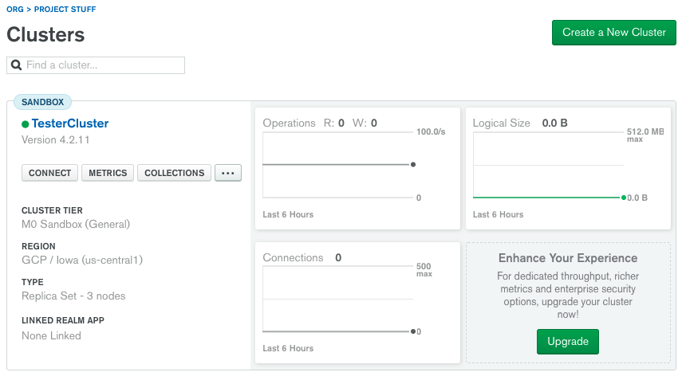

# Creating a Node.js, Express, & MongoDB Backend From Scratch

I've been a big fan of React for a while, but that part of the MERN stack isn't involved in this post. If anyone does have a specific question about how to the backend we are about to build up with a React frontend, please leave a comment and I would be happy to make a new post with that information as well.

Since this is focused on MERN without the R, the acronym we'll use for this post is MEN. Why not. Finally, MEN will be useful! 😄

Here's the overview of the steps we're covering in this post: 

1. Initializing a folder with a package manager
2. Adding necessary dependencies (and discussing the purposes of each)
3. Establishing a connection to MongoDB through [Atlas](https://www.mongodb.com/cloud/atlas)
4. Establishing an Express application & selecting the local port on which to run it
5. Creating A Model
6. Creating CRUD routes for that model
7. Testing your code out with an API tester like Postman or Insomnia

The *fully complete codebase* for this project is public at [THIS](https://github.com/halented/men-backend-codebase) github repo, if you would rather just poke around than reading this whole walkthrough. 

It should be a good time. This post will assume that you have a medium level of JavaScript/programming capabilities -- that is, if you are just starting out with learning JS, this post might knock you on your ass, so bookmark it for later and revisit when you're pretty good with the basics. This post also assumes you have NodeJs installed on your computer already. You can check if you do by running the command `node -v` in your terminal. If it does not spit out a version for you, please install Node from [HERE](https://nodejs.org/en/) before beginning this walkthrough. 

Other than that, if you're ready to go then let's go!

## Initializing a folder with a package manager

This part is pretty straightforward. 
- From your terminal, navigate to whatever directory you want this project to live in
- Make a new folder with `mkdir MEN-backend`
- `cd` into that folder
- Enter the command `yarn init` or `npm init`, depending on which package manager you want to use. 

The differences between yarn and npm are negligable for our circumstances, but I use yarn because the word's cute. Once you've done that, your terminal will ask you a series of questions -- you can just slam on the enter key a bunch of times to stick with the defaults, or you can change the versioning/name/licensing info at your discretion. These details will not affect the project.

Once that's complete, you'll notice a package.json file appear inside your MEN-backend directory. This is where your project will keep track of necessary dependencies and libraries that we'll be installing, like Express.

One that note, let's get to installing.

## Adding necessary dependencies 

One important tip for this section: the words *dependency*, *library*, and *package* are going to be used pretty much interchangably. I'm just using these phrases to reference any outside code base that we'll be making use of in our project. 

The first thing add is [Express](http://expressjs.com/), of course. Very necessary for MEN. Adding packages to your established `package.json` file is pretty easy; from inside of our backend directory you can run the command `yarn add express` and watch as your terminal does the work of adding it. Once it's done, you will notice that a new folder, `node_modules` has appeared in our directory, as well as a file called `yarn.lock`. 

These two items help your project keep track of not only the libraries that you want to use in your project, but any libraries that those libraries are using. Do not edit these items directly. If something goes wonky with your yarn lock or node modules, just delete both of them and run `yarn install` to have 'em regenerate. 

Here are the other packages you should install. With each you can just run `yarn add <package name>` to add it to your package.lock file: 

- [cors](https://www.npmjs.com/package/cors)
    - CORS stands for "cross-origin resource sharing" and the package allows you to configure which domains are trusted and which ones are not. We will be making requests to our backend from a separate origin (that's where insomnia or postman will come into play), so we need to install CORS to allow us to do that. 

- [dotenv](https://www.npmjs.com/package/dotenv) 
    - We are going to need a sort of secret key to access our MongoDB on the Atlas website. If you plan on uploading your project to Github or some other code sharing site, you *shouldn't* upload your secret key as well. Best practices dictate that you should keep that kind of information in a local environment variable. The dotenv package will allow us to add a file called `.env` to our project, put our secret key in there, and load it into other files where necessary. The library will configure environment variables to your [process.env](https://codeburst.io/process-env-what-it-is-and-why-when-how-to-use-it-effectively-505d0b2831e7?gi=ce14aad160a0) object, which makes it global for your project. We'll also avoid pushing the `.env` to Github by adding it to a `.gitignore` file. 

- [mongoose](https://mongoosejs.com/docs/index.html)
    - Mongoose allows us to: map the model attributes and requirements to the database, create new collections and documents in our database, and make queries to retrieve info from the database.

- [nodemon](https://nodemon.io/)
    - We will use nodemon to actually serve the backend routes locally on whatever port we choose. If we were to choose port 5000, say, we can run nodemon to have our app served on http://localhost:5000/

## Establishing a connection to MongoDB / Establishing an Express App

There are different ways to use MongoDB, but using the Atlas website gives you a pretty clear and easy tools for interacting with your data, and you get one free database to fiddle around with so you don't have to pay to use it for our purposes. 

First, set up an account. Head to https://www.mongodb.com/cloud/atlas & fill out the Start Free steps. Pick the free options of course, and select "Shared Clusters" when prompted.

Under provider and region, select Google Cloud, and then pick whichever region is closest to you. This is where the server is located, so the closer you get the less latency between requests. Make sure your Cluster Tier is set to "M0 Sandbox", name it whatever you'd like, and click Create Cluster. 

You can just let that sit while it creates -- don't mess with the webpage or close it until it's done. While you're waiting, maybe listen to a song. Have some water. Stretch your back & unfocus your eyes for a second.

Okay, now it's time to write some code. 

In the topmost directory of your project, create a file called `server.js`. This is will act as the main hub for your app and its connections to the DB. The first thing we need to do is get Express in there. Here's what it looks like to actually establish an Exress app:

```javascript
const express = require('express')
const app = express()
```

The envoking parentheses following express call a constructor method from inside the Express library which builds the boilerplate for our app. Reminder! Express is a framework using NodeJs. It's the most important part of allowing us to use JavaScript as a backend server. 

Now that we've actually got an app to fiddle around with, let's tell that app that it should be allowed to accept requests from outside sources by handing it the CORS library. 

```javascript
const cors = require('cors')
app.use(cors())
```

Next we will tell the express app that it should expect to serve and receive data in the JSON format. Our MongoDB backend will take care of that for us, so we don't need to configure it on that end, just this one. 

```javascript
app.use(express.json())
```

Okay, the next thing is to actually connect your DB with your Express app. Here we have a group of libraries coming together to make ends meet. Firstly, we need to get Mongoose in there to usher the data back and forth for us -- we can think of Mongoose as a messenger which speaks to our Express app, travels over to MongoDB, delivers some info, then carries Mongo's response back to the app. Begin by requiring it -- 

```javascript
const mongoose = require('mongoose')
```

and then calling upon the `connect` function to open a connection.


```javascript
mongoose.connect(source, {
    useNewUrlParser: true,
    useCreateIndex: true,
    useUnifiedTopology: true
})

const connection = mongoose.connection
connection.once('open', () => {
    console.log("DB connected.");
})
```

I realize that's a lot of unexplained code there, but we'll chat through it. The `connect` function accepts two arguments: the first is the the URL which points at our actual database on Atlas, and the second is a configuration object for how it should talk to that database. It's not highly important to memorize the details, but there have been some updates to both Mongoose and the Atlas setup which caused bumps in the road, so these configurations are just some standard fixes to make sure the communications still go smoothly. 

The second part, where we grab `mongoose.connection` out of the Mongoose library, is simply a listener. It listens your `connect` function, and throws up a little message on the server logs once that connection is successful. You can log whatever message you like. Maybe you just a put a Shakespeare quote on there or something. The world's your oyster. 

Okay, so you may have noticed that `source` is not defined anywhere in our code yet, so let's fix that. Head on over to the Atlas website again. It should have had plenty of time to finish setting up, so hopefully you see a screen that looks something like this:

 


Click the "CONNECT" button. Add your current IP address (since you will be making requests from your own computer), then make up whatever name and password you want to use for your secret connection URL. This doesn't really have to be that secure, since we are just using it to learn. I'm going to set mine to something pretty simple; username: "Hal", password: "Hal". Whatever you pick, keep ahold of it as we will use it. Click the "Choose a connection method" button. 

We haven't installed the mongo shell or MongoDB Compass, so let's just pick "Connect your application". After clicking that you'll see the URL we want! It'll look something like this: `mongodb+srv://Hal:<password>@testercluster.m7k7n.mongodb.net/<dbname>?retryWrites=true&w=majority`

Fill in the password and whatever you named your DB (I named mine TesterCluster). Now, we could just pop that URL into the `connect` function, and it would work just fine, but as was mentioned at the beginning, you shouldn't actually put your credentials and/or DB connection secrets out there in the open. So now we get to use the `dotenv` library.

```javascript
require('dotenv').config()
```

Calling on `config()` allows it to set up using the out-of-the-box configurations, which is totally fine for our purposes. With dotenv required, we can now create a file in our directory called `.env` which will house the new URL we just grabbed. The inside of our `.env` file just has a single line:

`ATLAS_CONNECTION = mongodb+srv://Hal:<Hal@testercluster.m7k7n.mongodb.net/TesterCluster?retryWrites=true&w=majority`

Once that is saved, the dotenv library will read your .env file and add a key of "ATLAS_CONNECTION" to your process.env object, with the value of the correct URL there. 

Reminder! You can log any of this stuff inside of your server.js file to check out what it looks like. If you're curious what process.env looks like on a whole, console.log it!